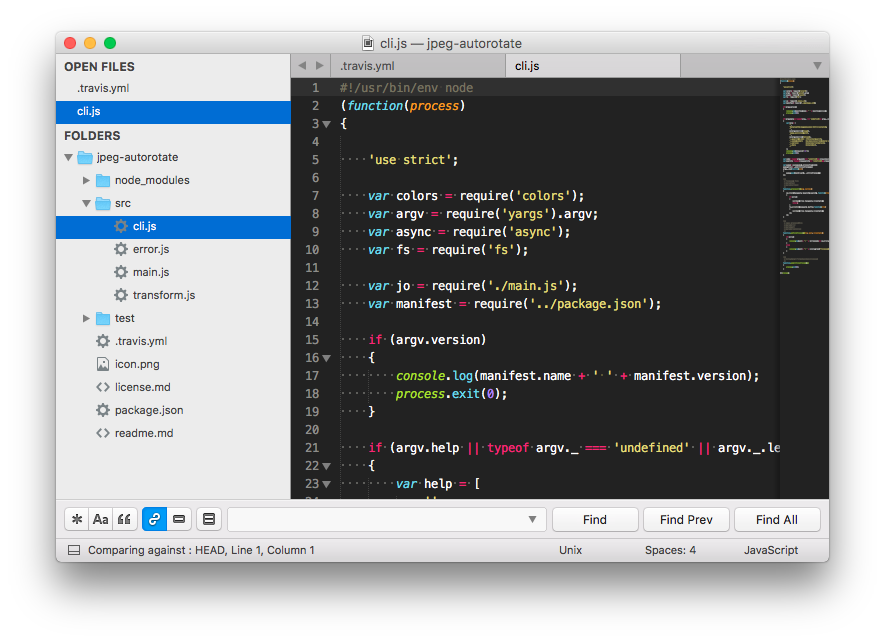
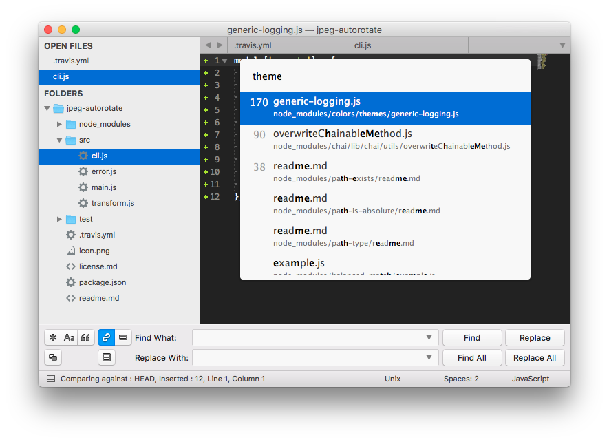
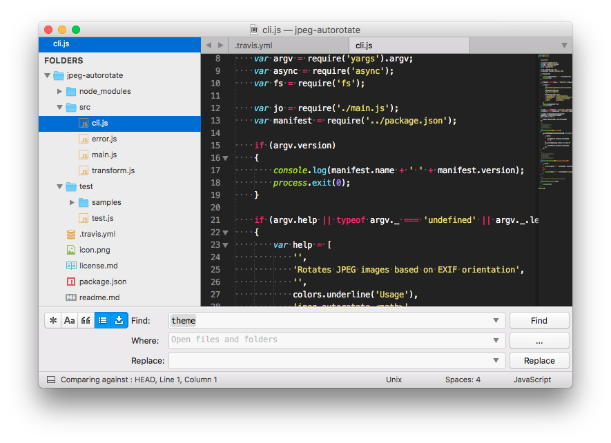

> A Sublime Text 3 theme for macOS

* [Screenshots](#screenshots)
* [Installation](#installation)
* [Activation](#activation)
* [Settings](#settings)
* [Changelog](#changelog)
* [Credits](#credits)
* [License](license.md)

## Screenshots


_Standard view, search panel:_



_GoTo panel, Search & Replace panel:_



_The theme works better with the [zz File Icons](https://packagecontrol.io/packages/zz File Icons) package:_



_Color scheme: [Monokai Extended](https://packagecontrol.io/packages/Monokai%20Extended)_

## Installation

### Install with [Package Control](https://packagecontrol.io/)

* Open the `Command Palette` (<kbd>CMD</kbd>+<kbd>MAJ</kbd>+<kbd>P</kbd>)
* Select `Package Control: Install Package`
* Search `Theme - Sienna` and hit <kbd>Enter</kbd>

### Install manually

* [Download](https://github.com/johansatge/sienna/archive/master.zip) the latest version of the project
* Unzip it and rename the directory to `Theme - Sienna`
* Open your packages directory (`Sublime Text` → `Preferences` → `Browse Packages...`)
* Move the `Theme - Sienna` directory there

## Activation

* Open your settings (`Sublime Text` → `Preferences` → `Settings`)
* Replace the `theme` key with `Sienna.sublime-theme`:

```diff
{
...
-    "theme": "YourPreviousTheme.sublime-theme",
+    "theme": "Sienna.sublime-theme",
...
}
```

Then, restart Sublime Text.

## Settings

The following parameters can be added in your settings file (`Sublime Text` → `Preferences` → `Settings`).

| Setting | Values | Default | Description
| --- | --- | --- | --- |
| `sienna_system_font` | `true|false` | `false` | Set to `true` to use the system font (if your system does not have the [San Francisco](https://developer.apple.com/fonts/) font installed, or if you experience UI issues) |

## Changelog

| Version | Date | Notes |
| --- | --- | --- |
| `1.1.0` | 2017-01-05 | Add `sienna_system_font` setting |
| `1.0.0` | 2016-12-28 | Initial version |

## Credits

This theme is based on the following awesome projects:

* [El Capitan Theme](https://github.com/iccir/El-Capitan-Theme) _(General inspiration, scrollbar & quick panel styles)_
* [Soda Theme](https://github.com/buymeasoda/soda-theme) _(Buttons style)_
* [zz File Icons](https://github.com/ihodev/sublime-file-icons) _(Icons)_
